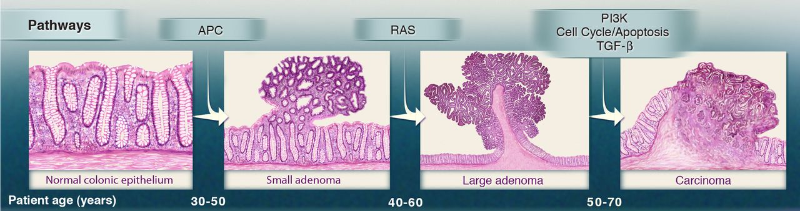
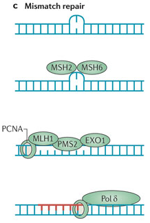
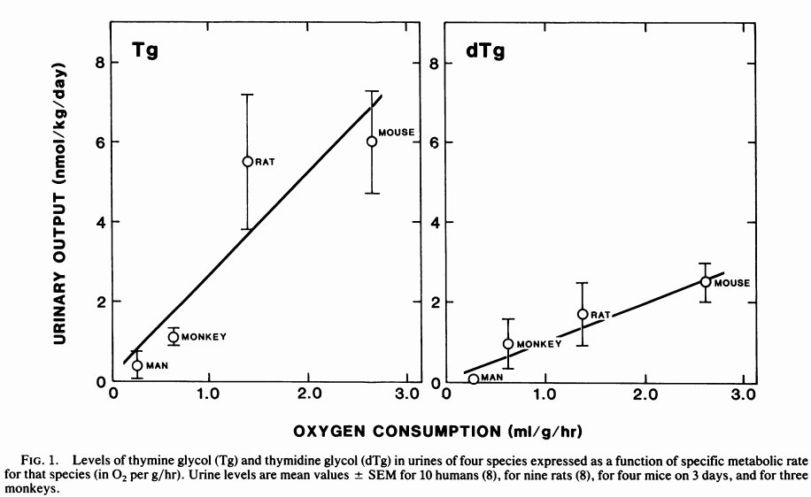
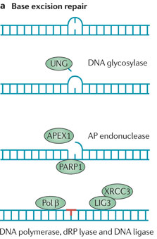
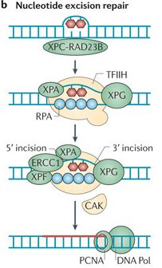

<!-- Limit image width and height -->

<!-- Center image on slide -->

<!-- Italic -->

<!-- Bold -->

--- .segue .dark .nobackground

## Recap

---

## Tumorigenees

- Pahaloomulise vähi teke on pikaajaline protsess, mis tavaliselt võtab aega aastakümneid.
- Kasvaja progressioon põhineb rakkudes akumuleeruvatel juhuslikel geneetilistel või epigeneetilistel mutatsioonidel rakkude jagunemist ja ellujäämist reguleerivates geenides.
- Mutatsioonid, mis annavad tulevasele vähirakule selektiivse eelise nimetatakse juht- või draivermutatsioonideks (*driver*).

--- .segue .dark .nobackground

## Tüvirakud on mutageneesi märklauad

---
## Epiteelirakkude regeneratsioon sooleepiteelis

- Soole luumen sisaldab suures koguses toksiine ja baktereid.
- Inimene kaotab umbes 10$^{11}$ epiteelirakku (~200 g) igapäevaselt.
- Laborihiire soole krüptis asuvad tüvirakud jagunevad elu jooksul umbes 1000 korda ilma jagunemispotentsiaali kaotamata ja kartsinogeensed mutatsioonid on harv nähtus.
- Sooleepiteeli regeneerivad **tüvirakud** ja **transitoorselt paljunevad rakud** (*transit-amplifying, TA*).
- Tüvirakud moodustavad 0.1-1% koe rakkudest.
- Epiteelkoe rakud diferentseeruvad transitoorselt paljunevatest rakkudest.
- Erütrotsüütide eluiga on ~120 päeva, mille järel nad põrnas endotsüteeritakse.
- Käärsoole epiteeli eluiga on 5-7 päeva kui nad surevad.
- Naha keratinotsüüdid surevad 20-30 päeva jooksul.

---&twocol

## Epiteeli struktuur minimeerib geenikahjustusi
# Tüvirakkude genoom on hästi kaitstud

***=left

- Koes kõige seespool asub tüvirakunišš.
- Krüpti põhjas asuvad 5 tüvirakku on soole sisu eest kaitstud tingituna oma asukohast ja lima poolt. 
- TA rakud jagunevad 2-3 korda ja diferentseeruvad.

***=right

<footer class="source">Pilt: 
<a href="http://www.nature.com/nrm/journal/v15/n1/full/nrm3721.html">
Adult intestinal stem cells: critical drivers of epithelial homeostasis and regeneration
</a>
</footer>

---&twocol

## Soole mukoosa kaitseb vähi eest
# GI vähi intsidents Muc2 hiirtel

***=right

Grupp (n) | Hiiri GI vähiga 
-----------|-----------------------
Muc2+/+ | 
6 kuud (6) |	0 
1 aasta (18)	| 0	
Muc2−/− | |
6 kuud (19) | 3 (16%)
1 aasta (19)	| 13 (68%)

***=left

<footer class="source">Allikas: 
<a href="http://www.sciencemag.org/content/295/5560/1726.full">
Colorectal Cancer in Mice Genetically Deficient in the Mucin Muc2.
</a>
Pilt:
<a href="http://www.gastrojournal.org/article/S0016-5085(06)00762-1/fulltext">
Van der Sluis et al., 2006.
</a>
</footer>

---

## Tüvirakud on mutageneesi märklauad
# Pikaealised rakud kontributeerivad vähi tekkesse

- DMBA/TPA naha kartsinogeneesi mudeliga tekkinud papilloomid ja adenoomid pärinevad pigem vaikeolekus rakkudest (naha tüvirakud?) kui aktiivselt jagunevatest.
    - 5-FU (*fluorouracil*) mis inhibeerib aktiivselt jagunevaid rakke ei vähendanud oluliselt papilloomide teket, [Morris et al., 1997](http://cancerres.aacrjournals.org/content/57/16/3436.full.pdf).
- CML-i põhjustav __*Philadelphia* kromosoom__ (Ph$^1$, BRC-ABL translokatsioon) on olemas kõigis lümfoid ja müeloid raja rakkudes. 
    - See viitab, et mutatsioon on tekkinud **pluripotentses** tüvirakus.

---
## Tüvirakkude strateegiad
# Sümmeetriline ja asümmeetriline jagunemine

<footer class="source">Allikas: 
<a href="http://www.nature.com/nature/journal/v441/n7097/full/nature04956.html">
Asymmetric and symmetric stem-cell divisions in development and cancer.
</a>
</footer>

***=pnotes

- Asymmetric cell division: each stem cell generates one daughter stem cell and one daughter destined to differentiate. 
- **Population strategies**. A population strategy provides dynamic control over the balance between stem cells and differentiated cells — a capacity that is necessary for repair after injury or disease. In this scheme, stem cells are defined by their 'potential' to generate both stem cells and differentiated daughters, rather than their actual production of a stem cell and a differentiated cell at each division. 
- c, Symmetric cell division: each stem cell can divide symmetrically to generate either two daughter stem cells or two differentiated cells. 
- d, Combination of cell divisions: each stem cell can divide either symmetrically or asymmetrically.

---

## DNA kahjustuste vältimise strateegiad tüvirakkudes

Lisaks tüvirakkude suhteliselt **aeglasemale jagunemisele** ja nende **asumisele anatoomiliselt kaitstud kohtades**, toimib veel mitu teist mehhanismi:

- **Apoptoos**, röntgenkiirguse poolt kahjustatud hiire soole krüpti tüvirakud lähevad kiirelt apoptoosi selle asemel et DNA kahjustusi parandada.
- **Toksiinide aktiivne transport** rakust välja: MDR1 (*multi drug resistance 1*).
- **Asümmeetriline replitseerunud DNA jaotumine**.

---&twocol

## *Multi drug resistance* perekonna valgud
# Raku toksiinipumbad

***=left

- **MRP** (*MDR associated protein*) geeni transfektsioon SW-1573 inimese kopsu kartsinoomi rakkudesse muutis need rakud ravimiresistentseks.
- **ABC transporterid** on raku plasmamembraani ATP sõltuvad transpordivalgud, mis liigutavad rakust välja väga erinevaid substraate sh. toksiine.

***=right

Drug | Relative resistance
-----|--------------------
Doxorubicin | 2.7 ± 0.4
Daunorubicin | 3.2 ± 0.8
Vincristine | 5.3 ± 1.3
VP-16 | 4.9 ± 1.1
Colchicine | 3.6 ± 0.1
Rhodamine | 123 4.1 ± 0.3
Taxol | 1.0 ± 0.1

<footer class="source">Allikas:
<a href="http://www.pnas.org/content/91/19/8822.full.pdf">
Zaman et al., 1994. 
</a>
</footer>

---

## P-glükovalgu struktuur
# *P-glycoprotein/MDR1*

<footer class="source">Pilt: 
<a href="http://www.rcsb.org/pdb/101/motm.do?momID=123">
P-glycoprotein. 
</a> Wikipedia: 
<a href="http://en.wikipedia.org/wiki/P-glycoprotein">
P-gp wiki.
</a>
</footer>

***=pnotes

## P-glycoprotein

March 2010 Molecule of the Month by David Goodsell.

doi: 10.2210/rcsb_pdb/mom_2010_3.

Keywords: multidrug resistance, cancer chemotherapy, P-glycoprotein, membrane transport.

# Introduction

Our environment is filled with toxic substances that attack our molecular machinery. Our cells protect themselves from these dangers in many ways. In some cases, they use enzymes to convert them into harmless compounds. In other cases, they sequester them safely out of the way. For others, cells build specialized pumps that find toxins and eject them outside, for safe disposal.

# Clean Sweep

P-glycoprotein is the most common molecular pump protecting our cells from toxic molecules. It sits in the cell membrane and searches for foreign hydrophobic molecules. When it finds one, it grabs the molecule in a pocket deep within the protein, and then flips to a new conformation. The new conformation has an opening towards the outside of the cell, and the molecule is ejected. The whole process is powered by ATP to ensure that everything happens in a timely manner.

# Powerful Pump

Of course, to be effective in its job, P-glycoprotein needs to be able to eject many different types of molecules. Scientists have found the P-glycoprotein pumps hundreds of different molecules, ranging is size from tens to hundreds of atoms. Most are hydrophobic and are normally found in the membrane. These include many toxic molecules, but also important drugs like cyclosporin and anticancer drugs. Thus, the action of P-glycoprotein can be both beneficial and harmful, protecting us from toxins but also reducing the effectiveness of the therapeutic drugs we take.

# Blocking the Pump

Cancer cells in metastatic cancers are often particularly difficult to treat because they have become resistant to many different anticancer drugs. In some cases, these cells gain their multidrug resistance by building extra P-glycoprotein, which continually ejects the anticancer drugs out of the cancer cells. Therapeutic antibodies bind to small regions on P-glycoprotein and block the motions needed for pumping. Another approach is to find drugs that lodge in the active site of the protein, blocking its action from the inside.

---&twocol

## Asümmeetriline DNA jaotumine tütarrakkude vahel
# Raku jagunemisel peegeldub tütarrakkude saatus ka nende DNA-s.

***=left

***=right

- Kui tüvirakud jagunevad, siis õdekromatiidid mis sisaldavad vanemat DNA ahelat (pildil roheliselt fluorestseeruv) segregeeruvad ühte tütarrakku.
- Vanem DNA segregeerub tavaliselt vähem diferentseerunud tütarrakku.

<footer class="source">Allikas: 
<a href="http://www.ncbi.nlm.nih.gov/pmc/articles/PMC1852587/">
Richard Robinson, 2007.
</a>
</footer>

---&twocol

## Matriits DNA selektiivne segregatsioon
# Konserveerunud DNA ahel jääb tüviraku kompartementi

***=right

***=left

- DNA ahelad mida replikatsiooni käigus ei sünteesitud on nn. "konserveerunud" matriits ahelad.
- Värskelt sünteesitud DNA on "mitte-konserveerunud".
- [Cairnsi hüpotees, 1975](http://www.nature.com/nature/journal/v255/n5505/abs/255197a0.html): replitseerunud tüviraku matriits DNA segregeerub tüvirakust tütarrakule ja uuesti sünteesitud ahelat sisaldav DNA pärandub transitoorselt prolifereeruvale tütarrakule.

---

## Tüviraku nišš ei jagune intensiivselt
# Somaatilised tüvirakud ei märgistu hästi DNA-sse lülituvate ühenditega, välja arvatud tekkimisel ja koe kahjustuste korral.

- Somaatilised tüvirakud säilitavad oma tekkimisel DNA-sse lülitatud märgise (3H-tümidiin) väga pika-aegselt.
- Lühiajaline kudede inkubeerimine 3H-tümidiiniga märgistab ainult transitoorselt jagunevad rakud ning koe uuenedes märgis kaob ruttu.
- Hiirtel puberteedis rinnanäärme tüvirakkude nišši moodustumisel sisse viidud 3H-tümidiin jääb aga sinna pidama sest tüvirakud jagunevad veel sümmeetriliselt (tekib kaks tüvirakku).

<footer class="source">Pilt: 
<a href="http://dev.biologists.org/content/132/4/681.long">
Smith, 2005.
</a>
</footer>

---

## Konserveerunud DNA-d sisaldavad rakud karvanääpsus

_**Label-retaining cells**_ eksperimentaalselt defineeritud rakupopulatsioon,  mis säilitavad DNA-sse lülitatud märgise (nt. BrdU) ja mis peaksid olema aeglaselt jagunevad tüvirakud.

<footer class="source">Pilt: 
<a href="http://www.ncbi.nlm.nih.gov/pmc/articles/PMC3050564/">
Hsu et al., 2011.
</a>
</footer>

---

## Mutantsete tüvirakkude teke läbi tsütotoksilisuse
# Krooniline koekahjustumine võib istutada mutantse DNA tüviraku nišši

- Kartsinogeenid võivad toimida läbi koekahjustuse, kui kahjustada saavad ka tüvirakud.
- Tüviraku sümmeetriline jagunemine võib põhjustada viimases S-faasis sünteesitud mutantse DNA jäämise tüviraku nišši.
- Selline mutantne DNA omandab siis nn "surematu" staatuse.
- Alkohol, mis toimib tuumori promootorina, põhjustab just sellist tüüpi kahjustusi suuõõne epiteelile.
- Hüpoteetiline? **super kartsinogeen** oleks sellisel juhul aine mis on üheaegselt tsütotoksiline ja mutageenne.

---

## Biokeemilised DNA reparatsioonimehhanismid

Lisaks raku ja koe tasemel toimivatele mehhanismidele, mis peaksid minimeerima muteerunud somaatilise DNA säilimise ja pärandumise ekisteerivad loomulikult ka biokeemilised DNA reparatsioonimehhanismid.

Biokeemilised reparatsioonimehhanismid toimivad muutustele nagu:
- **replikatsioonivead** mis tekivad DNA sünteesil (vale nukleotiidi lülitamine ahelase),
- **nukleotiidide spontaansed biokeemilised muutused** (depurineerumine ja depürimidineerumine, deamineerumine),
- **mutageensete ühendite poolt põhjustatud nukleotiidide muutused** (kiirgus, alkülatsioon).

---

## DNA replikatsiooni vead
# Imetajate genoomis on 15 DNA polümeraasi. Mõned funktsioneerivad genoomi replikatsioonil, kuid enamus toimivad DNA kahjustuste parandamisel

- DNA replikatsiooni viivad läbi DNA Pol $\alpha$, Pol $\delta$ ja Pol $\epsilon$.
- DNA polümeraasid lülitavad vigase nukleotiidi DNA-sse sagedusega 1/100000 aluspaari kohta ($10^{-5}$).
- Inimese genoomi replitseerimisel teeb see diploidses rakus oleva $6\times10^{9}$ aluspaari kohta  60000 mutatsiooni.

---

## Hüpotees

<q>
Ilma genoomi korrashoiu mehhanismide lõhkumiseta oleks spontaanne raku mutatsioonisagedus liiga madal, et akumuleeruksid tumorigeneesiks vajalikud mutatsioonid.
</q>

---

## Proofreading ja mismatch repair

- Kui DNA Pol ($\alpha$, $\delta$, $\epsilon$) lülitab vale nukleotiidi ahelasse, korrigeerib ta selle kohe oma 3'-5' eksonukleaasse aktiivsuse abil (**proofreading**)
- Proofreading põhineb, sellel et polümeraas tunneb järgmise nukleotiidi lülitamisel ära "vales" asendis 3' OH rühma ja jääb kinni.
- Proofreadingu tasemel eemaldatakse 99% vigu, sellest läbi lipsanud vead parandab **mismatch repair** mehhanism.
- Koos proofreadingu ja MMR mehhanismiga on totaalne vigade sagedus replikatsioonil $10^{-9}$.

<footer class="source">Pilt: 
<a href="http://www.nature.com/ng/journal/v45/n2/full/ng.2540.html">
Seshagiri, 2013.
</a>
</footer>

---&twocol

## The proofreading is crucial for preventing mutations

***=left

- Pold1 või Pole katalüütilise subühiku eksonukleaasse aktiivsuse mutantsetel hiirtel on 10 korda kõrgem mutatsioonisagedus ja neil tekivad spontaansed kasvajad.
- $Pold1^{exo/exo}$ hiired surevad 8 kuu vanustena erinevate kasvajate tagajärjel.
- $Pole^{exo/exo}$ surevad enneaegselt soole adenoomide ja adenokartsinoomide tõttu.
- $Pole^{exo/exo}$;$Pold1^{exo/exo}$ kaksik-mutantsed hiired surevad veelgi kiiremini tüümuse lümfoomide kätte.
- Mlh1 (*MutL homologue*) - MMR valk

***=right

<footer class="source">Pilt: 
<a href="http://www.pnas.org/content/106/40/17101.full">
Albertson et al., 2009.
</a>
</footer>

---&twocol
## Pärilikud POLE and POLD1 mutatsioonid inimese soolevähis

***=left

- Heterosügootsed pärilikud POLE või POLD1 geenivariandid esinesid mitmetes multi-adenoomi ja või CRC patsientidel kuid mitte tervetel isikutel.
- Geenivariantidel POLE p.L424V ja POLD1 p.S478N on kõrge penetrantsus ja POLD1 mutatsioonid tõstsid ka endomeetriumivähi riski.
- POLE p.L424V ja POLD1 p.S478N mutatsioonid asuvad DNA polümeraaside ε ja δ proofreading eksonukleaassetes domäänides.

***=right

**Pärmi *S. pombe* mudelis tõstis inimese POLD1 S478N mutatsiooni analoog tugevalt mutatsioonisagedust**.

Muutus |  Mutatsioonisagedus ($\times10^{9}$)| Tõus	(mutant/wild type)
-------|-------------------------------------|-------------------------
C462N | 72 (9.6) | 12
C462S	| 4.2 (2.1)	| 0.7
Wild type	| 6.0 (4.2)	| 1

<footer class="source">Pilt: 
<a href="http://www.nature.com/ng/journal/v45/n2/full/ng.2503.html">
Germline mutations affecting the proofreading domains of POLE and POLD1 predispose to colorectal adenomas and carcinomas.
</a>
</footer>

---&twocol

## MMR ja mikrosatelliitide ebastabiilsus

Mononukleotiidsed kordusjärjestused ehk **mikrosatelliidid** on eriti avatud replikatsioonivigadele mis on tingitud *mismatch repair* funktsiooni kadumise tõttu.

<footer class="source">Pilt: 
<a href="http://www.nature.com/scitable/topicpage/dna-replication-and-causes-of-mutation-409#">
DNA Replication and Causes of Mutation.
</a>
</footer>

---&twocol

## Mikrosatelliitide ebastabiilsus soolevähis

***=right

-  Vähi DNA milles esineb selline **mikrosatelliitide ebastabiilsus** võib klassifitseerida kas 
    - **_MSI-H(igh)_** >30% mikrosatellitide markereist on muutunud,
    - **_MSI-L(ow)_** <30% mikrosatellitide markereist on muutunud.
- MSI-H esineb >80% mittepolüposse päriliku soolevähi patsientidel ja 100% patsientidel kellel on pärilikud ja hMSH2 või hMLH1 mutatsioonid.

***=left

MSI ebastabiilsus patsiendil kellel on nii soolevähk (C) kui rinnavähk (B).

<footer class="source">Pilt: 
<a href="http://cancerres.aacrjournals.org/content/62/4/1014.full">
Exclusion of Breast Cancer as an Integral Tumor of Hereditary Nonpolyposis Colorectal Cancer.
</a>
</footer>

---&twocol

## *Mismatch repair*

***=left

- MMR on kahjustust välja lõikav protsess, kus mittepaarduvad nukleotiidid lõigatakse ahelast välja.
- MMR on seotud DNA replikatsiooniga, MMR valgud interakteeruvad PCNA-ga.
- Mittepaardumine põhjustab DNA paindumise/mügara (*bulge*) mis viib MMR valkude värbamiseni ja need lõikavad välja DNA segmendi kahjustusest lähima üheahelalise katkestuseni (*nick*) ja DNA pol$\delta$ sünteesib jäänud tühimiku täis.

***=right

---

## Endogeensed biokeemilised protsessid

- Normaalses raku keskkonnas neutraalsel pH-l esineb madalas kontsentratsioonis ($~10^{-7}M$) vesinik ja hüdroksüül ioone, 
- mis reageerivad DNA-ga ja põhjustavad nukleotiidide **depurineerumist** või **depürimideerumist** ja **deamineerumist**.

---

## Depurinatsioon

- **Depurinatsioon** on spontaanne adeniini või guaniini eraldumine deoksüriboosist.
- Imetajarakus toimub umbes 10000 depurinatsiooni päevas (seega, terves inimese kehas kehas kaotab $10^{17}$ nukleotiidi iga päev oma puriini!).
- **Depürimideerumine** toimub kuni 100 korda väiksema sagedusega (500 päevas).
- Stabiilselt on inimese rakus genoomi kohta 4000-15000 alusevaba nukleotiidi.

---&twocol

## Deaminatsioon

- **Deaminatsiooni** tõttu kaotavad tsütosiin, adeniin või guaniin oma amiinrühma.

***=right

- Uratsiili võib järgmise replikatsiooni ajal lugeda kui tümiini põhjustades C>T mutatsiooni.
- Deamineeritud nukleotiidid reeglina parandatakse reparatsiooniensüümide poolt.
- 5-Metüültsütosiini deamineerimise tagajärjel tekib täiesti normaalne tümiin ja T:G paardumine võib reparatsioonile "nähtamatuks" jääda põhjustades C>T punktmutatsiooni. 

***=left

---

## DNA oksüdeerimine

Mitokondriaalset või peroksüsomaalset päritolu hapniku radikaalid põhjustavad DNA aluste oksüdatsiooni. Tekib terve rida reaktsiooniprodukte.

<footer class="source">Pilt: 
<a href="http://www.fasebj.org/content/17/10/1195.full">
DNA base products of interaction with reactive oxygen and free radical species.
</a>
</footer>

---

## DNA oksüdatsioon on seotud aeroobse metabolismiga

<footer class="source">Pilt: 
<a href="http://www.pnas.org/content/85/8/2706.long">
Oxidative damage to DNA: Relation to species metabolic rate and life span.
</a>
</footer>

---&twocol

## UV põhjustatud DNA kahjustused

***=left

- CPD on kõige sagedasem UV poolt indutseeritud kahjustus.
- CPD moodustub kui kui kõrvuti asetsevate pürimidiinide C5 ja C6 vahel tekib kovalentne side ja moodustub **tsüklobutaan ring**.
- Aluspaardumine tavaliselt ei häiru CPD tekkimise korral.
- CPD moodustub kõige sagedamini kõrvuti asetsevate tpmiinide vahel (TT-CPD).

***=right

# Tsüklobutaan pürimidiin dimeer (CPD) ja  6-4-fotoprodukt

---

# 6-4-fotoprodukt

- Sageduselt teine UV kahjustus.
- Moodustub kovalentne side 5' pürimidiini C6 positsiooni ja 3' kõrvalasuva pürimidiinaluse C4 pos. vahel.
- 6-4-fotoproduktid häirivad tugevalt DNA heeliksit.
- Moodustuvad sagedasti 5'-CT-3' dinukleotiidide vahele.

---&twocol

## C>A transversioonid suitsetajatel

***=left

- Üks sigaretimahv sisaldab $10^{10}$ osakest ja 4800 ühendit.
- Paljud ühendid on kartsinogeensed, sh polütsüklilised aromaatsed süsivesikud (PAH;  benzo[a]pyrene (BaP)), N-nitroosamiinid, aromaatsed amiinid ja metallid.
- Suitsetajatel on oluliselt kõrgem C>A transversioonide sagedus.
- Suitsetajate kopsuvähid sisaldavad 10X rohkem punktmutatsioone kui mittesuitsetajad.

***=right

<footer class="source">Pilt: 
<a href="http://www.sciencedirect.com/science/article/pii/S0092867412010227">
Genomic Landscape of Non-Small Cell Lung Cancer in Smokers and Never-Smokers.
</a>
</footer>

---

## DNA reparatsiooni ja kahjustuste tolereerimismehhanismid

# Reparatsioonimehhanismid

- **Lämmastikalust välja lõikav parandus** (*base excision repair*, *BER*),
- **Nukleotiide välja lõikav parandus** (*nucleotide excision repair*, *NER*).
- DNA katkestusi ja lünkasid (*gap*) parandatakse **homoloogse rekombinatsiooni** (*HR*) ja **mittehomoloogse otste ühendamise teel** (*NHEJ*).

# Tolereerimismehhanismid

- **Kahjustustest DNA läbisüntees** (*translesion DNA synthesis*)
- **Maatrikshela vahetus** (*template switching*)

---&twocol

## DNA reparatsiooniensüümide akumuleerumine on seotud kaheahelaliste katkestustega

***=left

- Vähirakkudes tekib DSB (*double starnd break*)-le tugev vastus, mis põhjustab reparatsioonivalkude akumuleerumise kromatiinile.
- Reparatsiooniensüümide ekspressiooni reguleerivad onkogeenid, pidev replikatsioonikahvlite initsatsioon ja põrkumine.
- Replikatsioonikahvlite toppamine tõstab DSB riski ja tagajärjeks on katkestuste kasv.

***=right

<footer class="source">Pilt: 
<a href="http://upload.wikimedia.org/wikipedia/en/6/6c/Interaction_of_XRCC4_in_NHEJ.jpg">
wikimedia.
</a>
</footer>

---

# Replikatsioonikahvli arresteerumine kahjustatud lämmastikaluste juures põhjustab genoomi ebastabiilsust

---

## Kahjustustest DNA ahela läbisüntees (TLS)

- Kui DNA kahjustus jääb parandamata põhjustab see replikatsioonikahvli toppama jäämise.
- Seiskunud kahvel kollapseerub ja põhjustab DSB, mis võib viia genoomi ebastabiilsuseni.
- **Rakud tolereerivad replikatsioonil ettejäävaid kahjustusi neist läbi sünteesides**.
- Replikatiivsed _proofreadingu_ aktiivsusega DNA polümeraasid Pol $\alpha$, $\delta$, $\epsilon$ ei suuda kahjustustest läbi sünteesida.
- Imetajarakus 7 DNA polümeraasi millel on TLS võime.
    - POLH, POLI (Pol-$\iota$), POLK, REV, Pol-$\zeta$, POLQ ja POLN.
- **Ühelgi TLS Pol-idest pole eksonukleasset _proofreadingu_ aktiivsust**.

---&twocol

## Lämmastikalust välja lõikav reparatsioon (BER)

***=left

- Substraadiks on uratsiiljäägid, ROS-kahjustatud alused, hüdrolüütilised reaktsiooniproduktid ja metülatsioonid.
- Kahjustatud lämmastikaluse eemaldab aluse spetsiifliline **DNA glükosülaas** (nt. UNG).
- Tekkinud lämmastikaluseta koha eemaldab **AP endonukleaas** (AP, *apyrimidinic* või *apurimidinic*; APEX1).
- 5'-deoksüriboosfosfaadi (dRP) lõikab välja **dRP lüaas** (POLB ühe domääni aktiivsus).
- Järele jäänud 1 nukleotiidse augu sünteesib täis **POLB** (Pol $\beta$).

***=right
- BER tähendab ühe nukleotiidi lämmastikaluse eemaldamist ja nukleotiidi asendamist.

--- &twocol

## Nukleotiide välja lõikav parandus (NER)

***=left
- Heeliksit rikkuvaid modifikatsioone põhjustavad 
    - UV kiirgus, cisplatin, polütsüklilised aromaatsed süsivesikud (PAH).
- Mõlemale poole kahjustust tehakse üheahelaline katkestus ja kahjustus lõigatakse välja.
- 27-29 nuklotiidi pikkune auk sünteesitakse uuesti POL-$\delta$ või POL-$\epsilon$ poolt.
- *GAP*-filling sõltub PCNA-st ja ssDNA siduvast RPA valgust.

***=right

NER eemaldab DNA heeliksit rikkuvad modifikatsioonid.

---

## Xeroderma pigmentosum

- Autosomaalne retsessiivne sündroom mida põdevaid inimesi iseloomustab äärmine fototundlikkus (intsidents 1:250000).
- Kõrge nahavähi risk ja neuroloogilised defektid.
- XP on põhjustatud inaktiveerivatest mutatsioonidest NER geenides.
- XP geene on kokku 8, seitse neist siis NER funktsiooniga.
- XP-V põhjustab TLS puudulikkus, mis on tingitud POLH mutatasioonidest.

<footer class="source">Pilt: 
<a href="http://upload.wikimedia.org/wikipedia/commons/thumb/4/4b/Xeroderma_pigmentosum_02.jpg/230px-Xeroderma_pigmentosum_02.jpg">
Wikimedia.
</a>
</footer>

---

## XP, bypass (TLS) polümeraas ja vähk
# XP-V põhjustavad mutatsioonid TLS DNA polümeraasis POLH (Pol-$\eta$).

- POLH vahendab tolerantsust UV-kiirguse poolt tekitatud TT-CPD-le.
- POLH inserteerib korrektselt AA nukleotiidid TT-CPD vastu.
- XP-V mutatsioonid rikuvad POLH interaktsioonid TT-CPD-ga.
- Polh-/- hiirtel tekivad UV-indutseeritud nahakasvajad.
- UV põhjustab Polh-/- hiirtel DNA kaheahelalisi katkestusi.
- XP-V patsientidel tekivad lamerakulised nahakartsinoomid, kui spontaansetest nahavähkidest POLH geeni mutatsioone leitud ei ole.
- Kopsu ja maokasvajates on POLH ekspressioon vähenenud.

---&twocol

## 6-4-fotoprodukti TLS
# 6-4-fotoproduktidest läbisünteesi viib korrektselt, vigadeta läbi POLI

***=left

- POLI võib sünteesida ka läbi TT-CPD, kui POLH on puudu, kuid mutageenselt/vigaselt.
- Poli-/- rakud ei ole UV tundlikud ja hiirtel ei teki kasvajaid.
- Poli-/-;Polh-/- hiirtel on võrreldes Polh-/- hiirtega hoopis UV mutagenees vähenenud, viidates et Poli on ~vigane tagavara Pol UV kahjustuste jaoks.
- Võib oletata, et POLI vastutab ka XP-V patsientide nahavähi eest.

***=right

- Poli-/-;Polh-/- topelt *knock-out* hiirtel tekib siiski natuke rohkem kasvajaid ja nad surevad rutem kui Polh-/- hiired.

<footer class="source">Pilt: 
<a href="http://mcb.asm.org/content/26/20/7696.full">
UV-B Radiation Induces Epithelial Tumors in Mice Lacking DNA Polymerase η and Mesenchymal Tumors in Mice Deficient for DNA Polymerase ι.
</a>
</footer>

---&twocol

## BER defektid ja vähk

***=left
- POLB-l on 5'-deoksüriboos-fosfaadi (dRP) lüaassne aktiivsus, mida on vaja lämmastikaluse kadumisel alles jääva suhkru eemaldamiseks DNA ahelast.
- POLB mutatsioone esineb 40% soolevähis ([Donigan et al., 2012](http://www.jbc.org/content/287/28/23830.abstract)).
- POLB on samas ka üle-ekspresseeritud erinevates vähkides.
- POLB üle-ekspressioon takistab normaalset replikatsiooni ja põhjustab mutatsioonide teket.
- Polb üle-ekspresseerivatel hiirtel tekib rohkem osteosarkoome.

***=right
- Polb KO hiired surevad embrüonaalselt.
- Polb+/- hiirtel on rohkem lümfoome, kuid elulemus oluliselt ei kannata.

<footer class="source">Pilt: 
<a href="http://cancerres.aacrjournals.org/content/66/15/7460.long">
Haploinsufficiency in DNA Polymerase β Increases Cancer Risk.
</a>
</footer>

---

## Melaniin kui päikesevari
# Naha UV kaitse

- Melanotsüüdid nahas sisaldavad melanosoome, mis kanduvad edasi keratinotsüütidesse.
- Melanosoomid moodustavad keratinotsüütides supranukleaarseid mütsikesi.

<footer class="source">Pilt: 
<a href="http://www.nature.com/jid/journal/v121/n4/full/5601970a.html">
Melano-phagolysosomes are organized into supranuclear "caps" within keratinocytes.
</a>
</footer>

---&twocol

## Glutatioon-S-transferaas (GST)

***=right

- Glutatioon on glütsiin-tsüsteiin-glutamiin tripeptiid.
- Endogeensed GST substraadid: O-Quinones of catecholamines and dopamine, postaglandins, lipid peroxidation products generated by reactive oxygen species.
- Eksogeensed GST substraadid: **polycyclic aromatic hydrocarbons**, **alpha, beta unsaturated aldehydes**, **molecules with epoxide groups**, **chemotherapeutic agents**.

***=left
- Glutatiooni konjugeerimine takistab tsütotoksilistel ainetel reageerida raku makromolekulidega/märklaudadega. 

<footer class="source">Pilt: 
<a href="http://www.nature.com/onc/journal/v22/n47/full/1206940a.html">
The role of glutathione-S-transferase in anti-cancer drug resistance.
</a>
</footer>

--- .segue .dark .nobackground

## Lingid teistele loengutele

--- &twocol 

***=left 

- [Sissejuhatav loeng](http://tpall.github.io/sissejuhatus)
- [Vähitüübid](http://rpubs.com/tapa741/vahityybid)
- [Onkoviirused](http://tpall.github.io/Onkoviirused)
- [Onkogeenid](http://tpall.github.io/Onkogeenid)
- [Retseptorid](http://tpall.github.io/Retseptorid)
- [Signaalirajad](http://tpall.github.io/Signaalirajad)
- [Tuumorsupressorgeenid](http://tpall.github.io/Tuumorsupressorid)
- [Rakutsüklikontroll](http://tpall.github.io/Rakutsyklikontroll)

***=right 

- [p53 ja apoptoos](http://tpall.github.io/p53-ja-apoptoos)
- [Immortalisatsioon](http://tpall.github.io/Immortalisatsioon)
- [Tumorigenees](http://tpall.github.io/Tumorigenees)
- [Genoomiterviklikkus](http://tpall.github.io/Genoomiterviklikkus)
- [Mikrokeskkond](http://tpall.github.io/Mikrokeskkond)
- [Metastaasid](http://tpall.github.io/Metastaas)
- [Immuunsus](http://tpall.github.io/Immuunsus)
- [Vähiravimid](http://tpall.github.io/Vahiravim)
