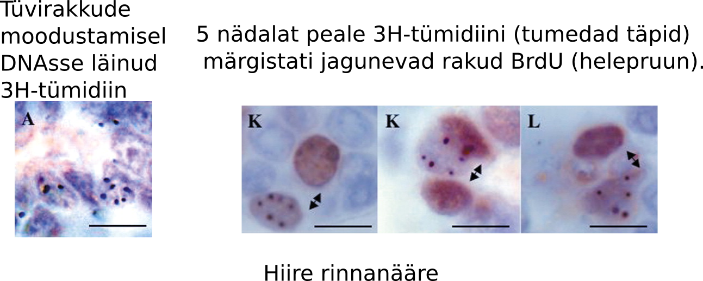

<!-- Limit image width and height -->

<!-- Center image on slide -->

<!-- Italic -->

<!-- Bold -->

--- .segue .dark .nobackground

## Recap

--- .segue .dark .nobackground

## Tüvirakud on mutageneesi märklauad

---
## Epiteelirakkude regeneratsioon sooleepiteelis

- Soole luumen sisaldab suures koguses toksiine ja baktereid.
- Inimene kaotab umbes 10$^{11}$ epiteelirakku (~200 g) igapäevaselt.
- Laborihiire soole krüptis asuvad tüvirakud jagunevad elu jooksul umbes 1000 korda ilma jagunemispotentsiaali kaotamata ja kartsinogeensed mutatsioonid on harv nähtus.
- Sooleepiteeli regeneerivad **tüvirakud** ja **transitoorselt paljunevad rakud** (*transit-amplifying, TA*).
- Tüvirakud moodustavad 0.1-1% koe rakkudest.
- Epiteelkoe rakud diferentseeruvad transitoorselt paljunevatest rakkudest.
- Erütrotsüütide eluiga on ~120 päeva, mille järel nad põrnas endotsüteeritakse.
- Käärsoole epiteeli eluiga on 5-7 päeva kui nad surevad.
- Naha keratinotsüüdid surevad 20-30 päeva jooksul.

---&twocol

## Epiteeli struktuur minimeerib geenikahjustusi
# Tüvirakkude genoom on hästi kaitstud

***=left

- Koes kõige seespool asub tüvirakunišš.
- Krüpti põhjas asuvad 5 tüvirakku on soole sisu eest kaitstud tingituna oma asukohast ja lima poolt. 
- TA rakud jagunevad 2-3 korda ja diferentseeruvad.

***=right

<footer class="source">Pilt: 
<a href="http://www.nature.com/nrm/journal/v15/n1/full/nrm3721.html">
Adult intestinal stem cells: critical drivers of epithelial homeostasis and regeneration
</a>
</footer>

---&twocol

## Soole mukoosa kaitseb vähi eest
# GI vähi intsidents Muc2 hiirtel

***=right

Grupp (n) | Hiiri GI vähiga 
-----------|-----------------------
Muc2+/+ | 
6 kuud (6) |	0 
1 aasta (18)	| 0	
Muc2−/− | |
6 kuud (19) | 3 (16%)
1 aasta (19)	| 13 (68%)

***=left

<footer class="source">Allikas: 
<a href="http://www.sciencemag.org/content/295/5560/1726.full">
Colorectal Cancer in Mice Genetically Deficient in the Mucin Muc2.
</a>
Pilt:
<a href="http://www.gastrojournal.org/article/S0016-5085(06)00762-1/fulltext">
Van der Sluis et al., 2006.
</a>
</footer>

---

## Tüvirakud on mutageneesi märklauad
# Pikaealised rakud kontributeerivad vähi tekkesse

- DMBA/TPA naha kartsinogeneesi mudeliga tekkinud papilloomid ja adenoomid pärinevad pigem vaikeolekus rakkudest (naha tüvirakud?) kui aktiivselt jagunevatest.
    - 5-FU (*fluorouracil*) mis inhibeerib aktiivselt jagunevaid rakke ei vähendanud oluliselt papilloomide teket, [Morris et al., 1997](http://cancerres.aacrjournals.org/content/57/16/3436.full.pdf).
- CML-i põhjustav __*Philadelphia* kromosoom__ (Ph$^1$, BRC-ABL translokatsioon) on olemas kõigis lümfoid ja müeloid raja rakkudes. 
    - See viitab, et mutatsioon on tekkinud **pluripotentses** tüvirakus.

---
## Tüvirakkude strateegiad
# Sümmeetriline ja asümmeetriline jagunemine

<footer class="source">Allikas: 
<a href="http://www.nature.com/nature/journal/v441/n7097/full/nature04956.html">
Asymmetric and symmetric stem-cell divisions in development and cancer.
</a>
</footer>

***=pnotes

- Asymmetric cell division: each stem cell generates one daughter stem cell and one daughter destined to differentiate. 
- **Population strategies**. A population strategy provides dynamic control over the balance between stem cells and differentiated cells — a capacity that is necessary for repair after injury or disease. In this scheme, stem cells are defined by their 'potential' to generate both stem cells and differentiated daughters, rather than their actual production of a stem cell and a differentiated cell at each division. 
- c, Symmetric cell division: each stem cell can divide symmetrically to generate either two daughter stem cells or two differentiated cells. 
- d, Combination of cell divisions: each stem cell can divide either symmetrically or asymmetrically.

---

## DNA kahjustuste vältimise strateegiad tüvirakkudes

Lisaks tüvirakkude suhteliselt **aeglasemale jagunemisele** ja nende **asumisele anatoomiliselt kaitstud kohtades**, toimib veel mitu teist mehhanismi:

- **Apoptoos**, röntgenkiirguse poolt kahjustatud hiire soole krüpti tüvirakud lähevad kiirelt apoptoosi selle asemel et DNA kahjustusi parandada.
- **Toksiinide aktiivne transport** rakust välja: MDR1 (*multi drug resistance 1*).
- **Asümmeetriline replitseerunud DNA jaotumine**.

---&twocol

## *Multi drug resistance* perekonna valgud
# Raku toksiinipumbad

***=left

- **MRP** (*MDR associated protein*) geeni transfektsioon SW-1573 inimese kopsu kartsinoomi rakkudesse muutis need rakud ravimiresistentseks.
- **ABC transporterid** on raku plasmamembraani ATP sõltuvad transpordivalgud, mis liigutavad rakust välja väga erinevaid substraate sh. toksiine.

***=right

Drug | Relative resistance
-----|--------------------
Doxorubicin | 2.7 ± 0.4
Daunorubicin | 3.2 ± 0.8
Vincristine | 5.3 ± 1.3
VP-16 | 4.9 ± 1.1
Colchicine | 3.6 ± 0.1
Rhodamine | 123 4.1 ± 0.3
Taxol | 1.0 ± 0.1

<footer class="source">Allikas:
<a href="http://www.pnas.org/content/91/19/8822.full.pdf">
Zaman et al., 1994. 
</a>
</footer>

---

## P-glükovalgu struktuur
# *P-glycoprotein/MDR1*

<footer class="source">Pilt: 
<a href="http://www.rcsb.org/pdb/101/motm.do?momID=123">
P-glycoprotein. 
</a> Wikipedia: 
<a href="http://en.wikipedia.org/wiki/P-glycoprotein">
P-gp wiki.
</a>
</footer>

***=pnotes

## P-glycoprotein

March 2010 Molecule of the Month by David Goodsell.

doi: 10.2210/rcsb_pdb/mom_2010_3.

Keywords: multidrug resistance, cancer chemotherapy, P-glycoprotein, membrane transport.

# Introduction

Our environment is filled with toxic substances that attack our molecular machinery. Our cells protect themselves from these dangers in many ways. In some cases, they use enzymes to convert them into harmless compounds. In other cases, they sequester them safely out of the way. For others, cells build specialized pumps that find toxins and eject them outside, for safe disposal.

# Clean Sweep

P-glycoprotein is the most common molecular pump protecting our cells from toxic molecules. It sits in the cell membrane and searches for foreign hydrophobic molecules. When it finds one, it grabs the molecule in a pocket deep within the protein, and then flips to a new conformation. The new conformation has an opening towards the outside of the cell, and the molecule is ejected. The whole process is powered by ATP to ensure that everything happens in a timely manner.

# Powerful Pump

Of course, to be effective in its job, P-glycoprotein needs to be able to eject many different types of molecules. Scientists have found the P-glycoprotein pumps hundreds of different molecules, ranging is size from tens to hundreds of atoms. Most are hydrophobic and are normally found in the membrane. These include many toxic molecules, but also important drugs like cyclosporin and anticancer drugs. Thus, the action of P-glycoprotein can be both beneficial and harmful, protecting us from toxins but also reducing the effectiveness of the therapeutic drugs we take.

# Blocking the Pump

Cancer cells in metastatic cancers are often particularly difficult to treat because they have become resistant to many different anticancer drugs. In some cases, these cells gain their multidrug resistance by building extra P-glycoprotein, which continually ejects the anticancer drugs out of the cancer cells. Therapeutic antibodies bind to small regions on P-glycoprotein and block the motions needed for pumping. Another approach is to find drugs that lodge in the active site of the protein, blocking its action from the inside.

---&twocol

## Asümmeetriline DNA jaotumine tütarrakkude vahel
# Raku jagunemisel peegeldub tütarrakkude saatus ka nende DNA-s.

***=left

***=right

- Kui tüvirakud jagunevad, siis õdekromatiidid mis sisaldavad vanemat DNA ahelat (pildil roheliselt fluorestseeruv) segregeeruvad ühte tütarrakku.
- Vanem DNA segregeerub tavaliselt vähem diferentseerunud tütarrakku.

<footer class="source">Allikas: 
<a href="http://www.ncbi.nlm.nih.gov/pmc/articles/PMC1852587/">
Richard Robinson, 2007.
</a>
</footer>

---&twocol

## Matriits DNA selektiivne segregatsioon
# Konserveerunud DNA ahel jääb tüviraku kompartementi

***=right

***=left

- DNA ahelad mida replikatsiooni käigus ei sünteesitud on nn. "konserveerunud" matriits ahelad.
- Värskelt sünteesitud DNA on "mitte-konserveerunud".
- [Cairnsi hüpotees, 1975](http://www.nature.com/nature/journal/v255/n5505/abs/255197a0.html): replitseerunud tüviraku matriits DNA segregeerub tüvirakust tütarrakule ja uuesti sünteesitud ahelat sisaldav DNA pärandub transitoorselt prolifereeruvale tütarrakule.

---

## Tüviraku nišš ei jagune intensiivselt
# Somaatilised tüvirakud ei märgistu hästi DNA-sse lülituvate ühenditega, välja arvatud tekkimisel ja koe kahjustuste korral.

- Somaatilised tüvirakud säilitavad oma tekkimisel DNA-sse lülitatud märgise (3H-tümidiin) väga pika-aegselt.
- Lühiajaline kudede inkubeerimine 3H-tümidiiniga märgistab ainult transitoorselt jagunevad rakud ning koe uuenedes märgis kaob ruttu.
- Hiirtel puberteedis rinnanäärme tüvirakkude nišši moodustumisel sisse viidud 3H-tümidiin jääb aga sinna pidama sest tüvirakud jagunevad veel sümmeetriliselt (tekib kaks tüvirakku).

<footer class="source">Pilt: 
<a href="http://dev.biologists.org/content/132/4/681.long">
Smith, 2005.
</a>
</footer>

---

## Konserveerunud DNA-d sisaldavad rakud karvanääpsus

_**Label-retaining cells**_ eksperimentaalselt defineeritud rakupopulatsioon,  mis säilitavad DNA-sse lülitatud märgise (nt. BrdU) ja mis peaksid olema aeglaselt jagunevad tüvirakud.

<footer class="source">Pilt: 
<a href="http://www.ncbi.nlm.nih.gov/pmc/articles/PMC3050564/">
Hsu et al., 2011.
</a>
</footer>

---

## Mutantsete tüvirakkude teke läbi tsütotoksilisuse
# Krooniline koekahjustumine võib istutada mutantse DNA tüviraku nišši

- Kartsinogeenid võivad toimida läbi koekahjustuse, kui kahjustada saavad ka tüvirakud.
- Tüviraku sümmeetriline jagunemine võib põhjustada viimases S-faasis sünteesitud mutantse DNA jäämise tüviraku nišši.
- Selline mutantne DNA omandab siis nn "surematu" staatuse.
- Alkohol, mis toimib tuumori promootorina, põhjustab just sellist tüüpi kahjustusi suuõõne epiteelile.
- Hüpoteetiline? **super kartsinogeen** oleks sellisel juhul aine mis on üheaegselt tsütotoksiline ja mutageenne.

---

## Biokeemilised DNA reparatsioonimehhanismid

Lisaks raku ja koe tasemel toimivatele mehhanismidele, mis peaksid minimeerima muteerunud somaatilise DNA säilimise ja pärandumise ekisteerivad loomulikult ka biokeemilised DNA reparatsioonimehhanismid.

Biokeemilised reparatsioonimehhanismid toimivad muutustele nagu:
- **replikatsioonivead** mis tekivad DNA sünteesil (vale nukleotiidi lülitamine ahelase),
- **nukleotiidide spontaansed biokeemilised muutused** (depurineerumine ja depürimidineerumine, deamineerumine),
- **mutageensete ühendite poolt põhjustatud nukleotiidide muutused** (kiirgus, alkülatsioon).

---

## DNA replikatsiooni vead
# Imetajate genoomis on 15 DNA polümeraasi. Mõned funktsioneerivad genoomi replikatsioonil, kuid enamus toimivad DNA kahjustuste parandamisel

- DNA replikatsiooni viivad läbi DNA Pol $\alpha$, Pol $\delta$ ja Pol $\epsilon$.
- DNA polümeraasid lülitavad vigase nukleotiidi DNA-sse sagedusega 1/100000 aluspaari kohta ($10^{-5}$).
- Inimese genoomi replitseerimisel teeb see diploidses rakus oleva $6\times10^{9}$ aluspaari kohta  60000 mutatsiooni.

---

## Proofreading ja mismatch repair

- Kui DNA Pol ($\alpha$, $\delta$, $\epsilon$) lülitab vale nukleotiidi ahelasse, korrigeerib ta selle kohe oma 3'-5' eksonukleaasse aktiivsuse abil (**proofreading**)
- Proofreading põhineb, sellel et polümeraas tunneb järgmise nukleotiidi lülitamisel ära "vales" asendis 3' OH rühma ja jääb kinni.
- Proofreadingu tasemel eemaldatakse 99% vigu, sellest läbi lipsanud vead parandab **mismatch repair** mehhanism.
- Koos proofreadingu ja MMR mehhanismiga on totaalne vigade sagedus replikatsioonil $10^{-9}$.

<footer class="source">Pilt: 
<a href="http://www.nature.com/ng/journal/v45/n2/full/ng.2540.html">
Seshagiri, 2013.
</a>
</footer>

---&twocol

## The proofreading is crucial for preventing mutations

***=left

- Pold1 või Pole katalüütilise subühiku eksonukleaasse aktiivsuse mutantsetel hiirtel on 10 korda kõrgem mutatsioonisagedus ja neil tekivad spontaansed kasvajad.
- $Pold1^{exo/exo}$ hiired surevad 8 kuu vanustena erinevate kasvajate tagajärjel.
- $Pole^{exo/exo}$ surevad enneaegselt soole adenoomide ja adenokartsinoomide tõttu.
- $Pole^{exo/exo}$;$Pold1^{exo/exo}$ kaksik-mutantsed hiired surevad veelgi kiiremini tüümuse lümfoomide kätte.
- Mlh1 (*MutL homologue*) - MMR valk

***=right

<footer class="source">Pilt: 
<a href="http://www.pnas.org/content/106/40/17101.full">
Albertson et al., 2009.
</a>
</footer>

---&twocol
## Pärilikud POLE and POLD1 mutatsioonid inimese soolevähis

***=left

- Heterosügootsed pärilikud POLE või POLD1 geenivariandid esinesid mitmetes multi-adenoomi ja või CRC patsientidel kuid mitte tervetel isikutel.
- Geenivariantidel POLE p.L424V ja POLD1 p.S478N on kõrge penetrantsus ja POLD1 mutatsioonid tõstsid ka endomeetriumivähi riski.
- POLE p.L424V ja POLD1 p.S478N mutatsioonid asuvad DNA polümeraaside ε ja δ proofreading eksonukleaassetes domäänides.

***=right

Pärmi *S. pombe* mudelis tõstis inimese POLD1 S478N mutatsiooni analoog tugevalt mutatsioonisagedust.

Muutus |  Mutatsioonisagedus ($\times10^{9}$)| Tõus	(mutant/wild type)
-------|-------------------------------------|-------------------------
C462N | 72 (9.6) | 12
C462S	| 4.2 (2.1)	| 0.7
Wild type	| 6.0 (4.2)	| 1

<footer class="source">Pilt: 
<a href="http://www.nature.com/ng/journal/v45/n2/full/ng.2503.html">
Germline mutations affecting the proofreading domains of POLE and POLD1 predispose to colorectal adenomas and carcinomas.
</a>
</footer>

---

## Endogeensed biokeemilised protsessid

---

## Eksogeensed mutageenid

